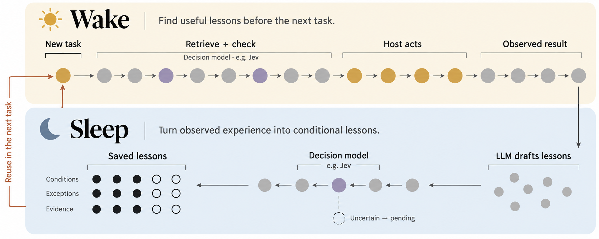

# Jev Lucid Memory

### Turn task experience into lessons. Check when to use them.

An experimental memory layer for AI agents. A local LLM writes lessons.
A **decision model**, such as Jev, judges what to keep and when to use it.

[Try it](#try-it) · [Results](docs/EVALUATION.md) · [Design](docs/CONCEPT.md) · [Research & roadmap](docs/RESEARCH.md)



**Research prototype.** Implements a wake–sleep memory loop with local evaluation.
Task-performance gains have not yet been demonstrated for this implementation.

## One lesson. Two different decisions.

Suppose an agent misses records because it reads only the first API page.
The intended lesson is:

> **When all records are requested, follow the page cursor until the end.**

| Next request | Intended memory decision |
|---|---|
| “Export **all** customer records.” | Use the lesson. |
| “Show **only the first page**.” | Skip the lesson. |

This is the behavior we want to test. The current system does not always get it right.

## Two phases. Three roles.

**Sleep — learn from the supplied record.** An LLM drafts a lesson from task observations.
A decision model checks its support. Code saves accepted lessons with their evidence.
Uncertain candidates stay pending.

**Wake — check before reuse.** Code finds candidate lessons. A decision model checks
whether their conditions fit the new task. The host agent receives the selected advice.

| Role | Job |
|---|---|
| **LLM** | Write the lesson. Include conditions and exceptions. |
| **Decision model** | Judge whether to save it or use it. Jev is one example. |
| **Code** | Check evidence hashes. Enforce scope. Save versions. |

The host runs tasks and supplies observations. Sleep runs when called; it is not an
automatic overnight process. Model weights do not change.

## What it does

- Separates reflection triggers, lesson admission and task applicability.
- Checks evidence hashes, namespace, tools and environment before model decisions.
- Keeps uncertain/conflicting candidates pending; never silently switches providers.
- Merges duplicate evidence, preserves immutable revisions and detects concurrent changes.
- Starts in **shadow mode**: records decisions without activating or injecting lessons.
- Includes a CLI, an opt-in Hermes hook and reproducible local evaluation scripts.

## The principle

**Keep the evidence. Keep the conditions. Allow “do not use.”**

A lesson is advice, not an instruction that overrides the user.
We measure success by better task outcomes and fewer harmful uses—not by how much memory we save.

## Is this LLM Wiki + Dreaming?

They are related ideas, with different jobs:

| Idea | What it adds | Included here? |
|---|---|---|
| **LLM Wiki** | Connected knowledge pages built from sources | No. Wiki integration is future work. |
| **Wake–Sleep memory** | Lessons from experience, checked before reuse | Yes, as a prototype. |
| **DreamCoder-style dreaming** | Generated practice examples used for learning | No. |

[Jev Wiki](https://github.com/JayYun98/jev-wiki) maintains source-backed Markdown knowledge.
Jev Lucid Memory applies the same **writer–decision model–code** separation to task experience.
Both are independent projects; Wiki integration is not implemented.
[Read the comparison and sources →](docs/CONCEPT.md)

## What has been verified?

- **55 tests and CI passed.** Local model calls, storage, retrieval and archiving were exercised.
- **A limitation remains.** A local writer produced overly broad advice. Both judges selected
  it for a request that should have tested a narrower condition.
- **No learning advantage established.** The small task evaluation did not show a gain
  for the gated variants over ordinary retrieval.

[Task results](docs/EVALUATION.md) · [Latest generated-lesson check](docs/REVERIFICATION.md)

## Try it

Python 3.11+ and `uv` are required.

```bash
git clone https://github.com/JayYun98/jev-lucid-memory.git
cd jev-lucid-memory
uv sync --locked
```

[Start the local Clef server](docs/LOCAL.md), then inspect a decision without activating a lesson:

```bash
uv run jev-memory admit examples/admission.jsonl
```

The default is **shadow mode**: it records decisions but does not activate lessons or
inject advice. Traces still remain in the local database.

<details>
<summary>Activate an accepted lesson and retrieve it</summary>

```bash
uv run jev-memory --apply admit examples/admission.jsonl
uv run jev-memory --apply wake examples/tasks.jsonl
```

An uncertain decision can leave the lesson pending. An empty retrieval is possible.

</details>

Local inference needs no API key. You can also use a local chat model or choose cloud Jev.
Cloud selection sends the relevant input to that provider.

<details>
<summary>Provider setup and full Sleep / Wake examples</summary>

### Use an existing local language model

Run an OpenAI-compatible server on `127.0.0.1:8123`. On Apple Silicon, for example,
install `mlx-lm` in a separate environment and run:

```bash
python -m mlx_lm.server --model /path/to/local-model --host 127.0.0.1 --port 8123
```

Use the model name accepted by your server:

```bash
export MEMORY_MODEL=/path/to/local-model
# Preview admission without activating a lesson.
uv run jev-memory --provider local-llm --model "$MEMORY_MODEL" admit examples/admission.jsonl
# Activate, then retrieve for a full-pagination task and a first-page counterexample.
uv run jev-memory --provider local-llm --model "$MEMORY_MODEL" --apply admit examples/admission.jsonl
uv run jev-memory --provider local-llm --model "$MEMORY_MODEL" --apply wake examples/tasks.jsonl
# Generate candidates from an episode, then assess admission.
uv run jev-memory --provider local-llm --model "$MEMORY_MODEL" --apply sleep \
  examples/episodes.jsonl --writer-model "$MEMORY_MODEL" --no-trigger
```

### Use local Clef-Flash

The server preserves the official **backbone and decision head**. It does not treat
Clef as a normal chat model. Follow [local serving](docs/LOCAL.md) to download a
pinned release and start the reference server on port 8766.

```bash
uv run jev-memory --apply admit examples/admission.jsonl
uv run jev-memory --apply wake examples/tasks.jsonl
```

The reflector still uses a separate local chat endpoint. Clef makes decisions;
it does not generate lesson text.

### Use a cloud decision model: Jev

Credentials come from your process environment. This package does not search personal
env files or save API keys in SQLite.

```bash
# Set OPENROUTER_API_KEY securely in your shell.
uv run jev-memory --provider openrouter admit examples/admission.jsonl
# Or install the optional official TypeSafe SDK and set TYPESAFE_API_KEY.
uv sync --extra jev
uv run jev-memory --provider typesafe admit examples/admission.jsonl
```

Explicit cloud selection sends the relevant task/observations to that provider.
Reflection remains local unless `sleep --cloud-writer --writer-model ...` is specified.

</details>

<details>
<summary>Reproduce the verification</summary>

```bash
uv run pytest --cov=jev_memory
uv run ruff check src tests scripts
uv run ruff format --check src tests scripts
uv run python -m build
# Actual local model calls; no API keys or paid inference.
uv run python scripts/eval_local.py --provider llm --model "$MEMORY_MODEL" \
  --writer-model "$MEMORY_MODEL" --output local/eval-llm.json
uv run python scripts/eval_local.py --provider clef --model clef-flash \
  --writer-model "$MEMORY_MODEL" --output local/eval-clef.json
```

See [evaluation protocol and results](docs/EVALUATION.md). Offline contract tests,
live local model results and downstream task success are reported separately.
A six-case smoke result is not evidence of general benchmark performance.

</details>

## Boundaries

[Hermes setup](docs/HERMES.md) · [Design decisions](docs/IMPLEMENTATION.md) ·
[Security](SECURITY.md)

The core uses lexical FTS5 retrieval, so paraphrases can be missed. Decision scores
are not calibrated guarantees. The default 0.8/0.2 thresholds are conservative
starting policies, not universally optimal values. Evidence hashes prove byte
identity, not truth: the host must supply trustworthy observations and verifiers.

Episode text and candidate lessons are stored locally, including in shadow mode.
Use a private database directory, redact sensitive traces, and treat all retrieved
advice as subordinate to current user and host instructions.

## Related work

Inspired by the [LLM Wiki pattern](https://gist.github.com/karpathy/442a6bf555914893e9891c11519de94f)
and the Harvey work highlighted in [Niko Grupen’s post](https://x.com/nikogrupen/status/2108226990792900876).
Harvey’s article reports gains from its own Jev-gated Wake–Sleep experiment.
Those results do not establish performance for Jev Lucid Memory.
[Article-to-code comparison and implementation gaps →](docs/HARVEY_COMPARISON.md)

[Clef-Flash](https://huggingface.co/Cloudflare/clef-flash) provides the open-weight
decision model. [Hermes](https://github.com/NousResearch/hermes-agent) is the first
host adapter. [SkillLearnBench](https://github.com/cxcscmu/SkillLearnBench) and
[AppWorld](https://github.com/StonyBrookNLP/appworld) inform the next evaluation stage;
this release does not claim results on either benchmark.

MIT licensed. Model weights and upstream projects retain their own licenses.
