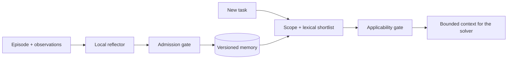

# Jev Memory

**Remember useful experience. Apply it only when the conditions fit.**

A small, host-independent wake–sleep memory core for agents. A local LLM writes
conditional lessons; **Clef-Flash or Jev** decides what to keep and when to use it.
SQLite preserves evidence, revisions and decision receipts.

Local inference is the default. No API key is required. Jev is an optional provider,
not a runtime dependency for local use.



## What it does

- Separates reflection triggers, lesson admission and task applicability.
- Checks evidence hashes, namespace, tools and environment before model decisions.
- Keeps uncertain/conflicting candidates pending; never silently switches providers.
- Merges duplicate evidence, preserves immutable revisions and detects concurrent changes.
- Starts in **shadow mode**: records decisions without activating or injecting lessons.
- Includes a CLI, an opt-in Hermes hook and reproducible local evaluation scripts.

This is an executable **proof of concept**, not a production-ready service.
See [scope and re-verification](docs/REVERIFICATION.md).

This is an experimental **lesson-memory** release. It does not train model weights,
execute learned code skills, or implement DreamCoder/Stitch abstraction learning.

## Quick start

Python 3.11+ and [uv](https://docs.astral.sh/uv/) are required.

```bash
git clone https://github.com/JayYun98/jev-memory.git
cd jev-memory
uv sync --locked
uv run jev-memory --help
```

### Use an existing local language model

Run an OpenAI-compatible server on `127.0.0.1:8123`. On Apple Silicon, for example,
install `mlx-lm` in a separate environment and run:

```bash
python -m mlx_lm.server --model /path/to/local-model --host 127.0.0.1 --port 8123
```

Use the model name accepted by your server:

```bash
export MEMORY_MODEL=/path/to/local-model
# Preview admission without activating a lesson.
uv run jev-memory --provider local-llm --model "$MEMORY_MODEL" admit examples/admission.jsonl
# Activate, then retrieve for a full-pagination task and a first-page counterexample.
uv run jev-memory --provider local-llm --model "$MEMORY_MODEL" --apply admit examples/admission.jsonl
uv run jev-memory --provider local-llm --model "$MEMORY_MODEL" --apply wake examples/tasks.jsonl
# Generate candidates from an episode, then assess admission.
uv run jev-memory --provider local-llm --model "$MEMORY_MODEL" --apply sleep \
  examples/episodes.jsonl --writer-model "$MEMORY_MODEL" --no-trigger
```

### Use local Clef-Flash

The server preserves the official **backbone and decision head**. It does not treat
Clef as a normal chat model. Follow [local serving](docs/LOCAL.md) to download a
pinned release and start the reference server on port 8766.

```bash
uv run jev-memory --apply admit examples/admission.jsonl
uv run jev-memory --apply wake examples/tasks.jsonl
```

The reflector still uses a separate local chat endpoint. Clef makes decisions;
it does not generate lesson text.

### Use Jev instead

Credentials come from your process environment. This package does not search personal
env files or save API keys in SQLite.

```bash
# Set OPENROUTER_API_KEY securely in your shell.
uv run jev-memory --provider openrouter admit examples/admission.jsonl
# Or install the optional official TypeSafe SDK and set TYPESAFE_API_KEY.
uv sync --extra jev
uv run jev-memory --provider typesafe admit examples/admission.jsonl
```

Explicit cloud selection sends the relevant task/observations to that provider.
Reflection remains local unless `sleep --cloud-writer --writer-model ...` is specified.

## Verification

```bash
uv run pytest --cov=jev_memory
uv run ruff check src tests scripts
uv run ruff format --check src tests scripts
uv run python -m build
# Actual local model calls; no API keys or paid inference.
uv run python scripts/eval_local.py --provider llm --model "$MEMORY_MODEL" \
  --writer-model "$MEMORY_MODEL" --output local/eval-llm.json
uv run python scripts/eval_local.py --provider clef --model clef-flash \
  --writer-model "$MEMORY_MODEL" --output local/eval-clef.json
```

See [evaluation protocol and results](docs/EVALUATION.md). Offline contract tests,
live local model results and downstream task success are reported separately.
A six-case smoke result is not evidence of general benchmark performance.

## Integration and boundaries

[Hermes setup](docs/HERMES.md) · [Design decisions](docs/IMPLEMENTATION.md) ·
[Security](SECURITY.md)

The core uses lexical FTS5 retrieval, so paraphrases can be missed. Decision scores
are not calibrated guarantees. The default 0.8/0.2 thresholds are conservative
starting policies, not universally optimal values. Evidence hashes prove byte
identity, not truth: the host must supply trustworthy observations and verifiers.

Episode text and candidate lessons are stored locally, including in shadow mode.
Use a private database directory, redact sensitive traces, and treat all retrieved
advice as subordinate to current user and host instructions.

## Related work

Inspired by [Jev Wiki](https://github.com/JayYun98/jev-wiki): **Jev decides. Your LLM
writes. Code preserves evidence.** That repository is currently private; it is a
provenance reference, not a required dependency. No private Wiki source is included.

[Clef-Flash](https://huggingface.co/Cloudflare/clef-flash) provides the open-weight
decision model. [Hermes](https://github.com/NousResearch/hermes-agent) is the first
host adapter. [SkillLearnBench](https://github.com/cxcscmu/SkillLearnBench) and
[AppWorld](https://github.com/StonyBrookNLP/appworld) inform the next evaluation stage;
this release does not claim results on either benchmark.

MIT licensed. Model weights and upstream projects retain their own licenses.
