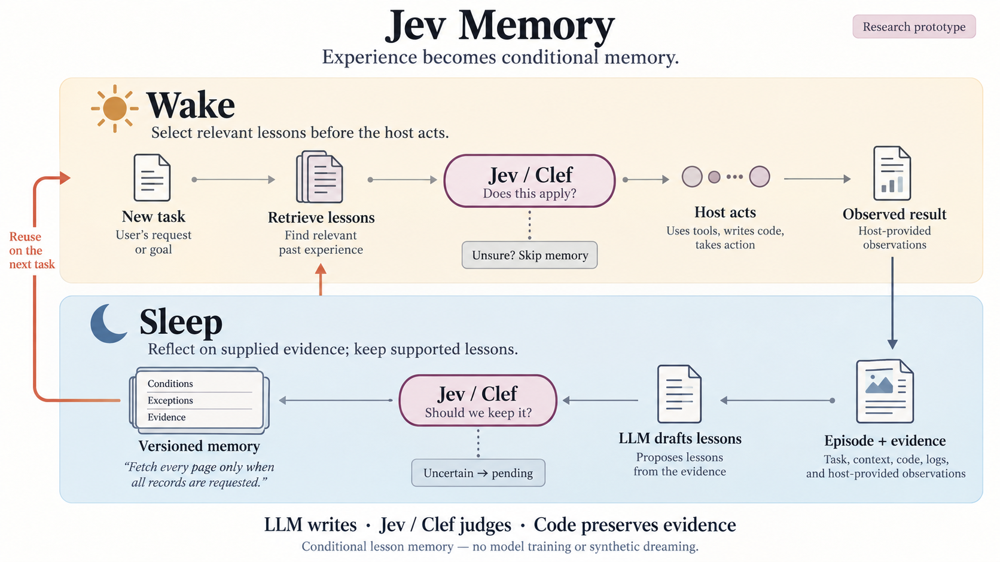
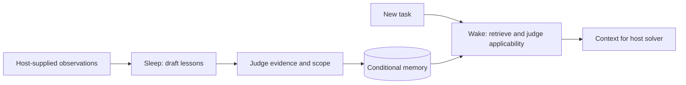

# Jev Memory

**Remember useful experience. Apply it only when the conditions fit.**



Jev Memory explores a simple question: **can an agent turn experience into useful
conditional advice, then recognize when that advice should—and should not—be reused?**

A local LLM proposes lessons from supplied task observations. **Clef-Flash or Jev**
judges whether those lessons are supported and applicable. Code preserves evidence,
versions and scope in SQLite. Model weights remain unchanged.

This is an executable **research proof of concept**. The memory mechanics run; useful
learning and improved task success are still hypotheses under evaluation.
Local inference is the default, and Jev is an optional provider.

[Concept & philosophy](docs/CONCEPT.md) · [Quick start](#quick-start) ·
[Observed results](docs/EVALUATION.md) · [Re-verification](docs/REVERIFICATION.md)

## The idea: experience → conditional memory → informed action

An agent can complete a task without retaining a reusable lesson. It can also remember
an overly broad lesson and apply it where it does not belong. We study both decisions:
**what is worth remembering, and when is it appropriate to use it?**

For example, a useful pagination lesson would be:

> When **all records** are requested from a cursor-paginated API, follow the cursor
> until completion. Do not extend a request for **only the first page**.

That is an intended lesson, not a claim that the current reflector always produces it.
[The latest local check](docs/REVERIFICATION.md#fresh-real-inference) produced broader
advice and failed to preserve this distinction.

### Wake and Sleep in this project

| Phase | Question | Current implementation |
|---|---|---|
| **Wake** | Which past lessons fit this task? | Scope filters → lexical shortlist → applicability decisions → bounded context |
| **Sleep** | What should this experience teach future tasks? | Supplied episode → optional reflection trigger → LLM lesson draft → admission decision → versioned memory |

The host solves the actual task and supplies observations. The core does not collect
all host activity automatically. “Sleep” means a separate reflection step; it is not
an always-running background service or an overnight scheduler.



### Is this Dreaming?

**Wake–Sleep names the phase structure; Dreaming can name a method used within Sleep.**
The terms are not interchangeable, and different projects use them differently.
In [DreamCoder](https://github.com/ellisk42/ec/blob/master/dreamcoder/dreaming.py),
generated program/task examples contribute to training a recognition model; its
[main loop](https://github.com/ellisk42/ec/blob/master/dreamcoder/dreamcoder.py) also
learns program-library abstractions. Our Sleep reflects on existing observations.
It does not generate dream tasks, train a recognition network or discover reusable functions.
This is an analogy to the phase separation, not a reproduction of DreamCoder.

### Where does LLM Wiki fit?

[LLM Wiki](https://gist.github.com/karpathy/442a6bf555914893e9891c11519de94f) describes
maintaining an interconnected knowledge base from sources. Jev Memory focuses on
conditional advice extracted from task experience. A wiki can also contain procedures;
the difference here is the workflow and verification target, not the file format.

| Approach | Main artifact | Central question | Relationship here |
|---|---|---|---|
| LLM Wiki / Jev Wiki | Source-backed knowledge pages | What do the sources say, and how do they connect? | Complementary knowledge layer; no integration yet |
| Jev Memory | Lessons with conditions, exceptions and evidence | Should this experience guide the current action? | Implemented as an experimental memory core |
| DreamCoder | Programs, learned library and recognition model | Can learned structure improve program search? | Research inspiration; not implemented |

[Jev Wiki](https://github.com/JayYun98/jev-wiki) is our separate, currently private
project. We reuse its **division of responsibility**, not its code or storage:
**the LLM writes, the decision model judges, deterministic code commits.**
There is no bundled wiki, page ingestion, Markdown synchronization or shared index.
A future host could consult both systems; that is a proposed composition, not a current feature.

## Philosophy

- **Preserve the reason and the boundary.** A lesson needs supporting observations,
  preconditions and exceptions; a polished summary alone is insufficient.
- **Separate creation from judgment.** A writer can propose advice without granting
  itself authority to store or apply it. The judge is still fallible.
- **Treat memory as advice.** Retrieved experience cannot override the current request.
  Abstaining is preferable to forcing an uncertain match.
- **Measure behavior, not memory volume.** Storage and retrieval are intermediate
  mechanics. The goal is better task outcomes without harmful transfer; we have not
  established that benefit yet.

See [the fuller concept note](docs/CONCEPT.md) for the proposed Wiki relationship,
research boundaries and what would count as evidence that the idea works.

## What it does

- Separates reflection triggers, lesson admission and task applicability.
- Checks evidence hashes, namespace, tools and environment before model decisions.
- Keeps uncertain/conflicting candidates pending; never silently switches providers.
- Merges duplicate evidence, preserves immutable revisions and detects concurrent changes.
- Starts in **shadow mode**: records decisions without activating or injecting lessons.
- Includes a CLI, an opt-in Hermes hook and reproducible local evaluation scripts.

This is an executable **proof of concept**, not a production-ready service.
See [scope and re-verification](docs/REVERIFICATION.md).

This is an experimental **lesson-memory** release. It does not train model weights,
execute learned code skills, or implement DreamCoder/Stitch abstraction learning.

## Quick start

Python 3.11+ and [uv](https://docs.astral.sh/uv/) are required.

```bash
git clone https://github.com/JayYun98/jev-memory.git
cd jev-memory
uv sync --locked
uv run jev-memory --help
```

### Use an existing local language model

Run an OpenAI-compatible server on `127.0.0.1:8123`. On Apple Silicon, for example,
install `mlx-lm` in a separate environment and run:

```bash
python -m mlx_lm.server --model /path/to/local-model --host 127.0.0.1 --port 8123
```

Use the model name accepted by your server:

```bash
export MEMORY_MODEL=/path/to/local-model
# Preview admission without activating a lesson.
uv run jev-memory --provider local-llm --model "$MEMORY_MODEL" admit examples/admission.jsonl
# Activate, then retrieve for a full-pagination task and a first-page counterexample.
uv run jev-memory --provider local-llm --model "$MEMORY_MODEL" --apply admit examples/admission.jsonl
uv run jev-memory --provider local-llm --model "$MEMORY_MODEL" --apply wake examples/tasks.jsonl
# Generate candidates from an episode, then assess admission.
uv run jev-memory --provider local-llm --model "$MEMORY_MODEL" --apply sleep \
  examples/episodes.jsonl --writer-model "$MEMORY_MODEL" --no-trigger
```

### Use local Clef-Flash

The server preserves the official **backbone and decision head**. It does not treat
Clef as a normal chat model. Follow [local serving](docs/LOCAL.md) to download a
pinned release and start the reference server on port 8766.

```bash
uv run jev-memory --apply admit examples/admission.jsonl
uv run jev-memory --apply wake examples/tasks.jsonl
```

The reflector still uses a separate local chat endpoint. Clef makes decisions;
it does not generate lesson text.

### Use Jev instead

Credentials come from your process environment. This package does not search personal
env files or save API keys in SQLite.

```bash
# Set OPENROUTER_API_KEY securely in your shell.
uv run jev-memory --provider openrouter admit examples/admission.jsonl
# Or install the optional official TypeSafe SDK and set TYPESAFE_API_KEY.
uv sync --extra jev
uv run jev-memory --provider typesafe admit examples/admission.jsonl
```

Explicit cloud selection sends the relevant task/observations to that provider.
Reflection remains local unless `sleep --cloud-writer --writer-model ...` is specified.

## Verification

```bash
uv run pytest --cov=jev_memory
uv run ruff check src tests scripts
uv run ruff format --check src tests scripts
uv run python -m build
# Actual local model calls; no API keys or paid inference.
uv run python scripts/eval_local.py --provider llm --model "$MEMORY_MODEL" \
  --writer-model "$MEMORY_MODEL" --output local/eval-llm.json
uv run python scripts/eval_local.py --provider clef --model clef-flash \
  --writer-model "$MEMORY_MODEL" --output local/eval-clef.json
```

See [evaluation protocol and results](docs/EVALUATION.md). Offline contract tests,
live local model results and downstream task success are reported separately.
A six-case smoke result is not evidence of general benchmark performance.

## Integration and boundaries

[Hermes setup](docs/HERMES.md) · [Design decisions](docs/IMPLEMENTATION.md) ·
[Security](SECURITY.md)

The core uses lexical FTS5 retrieval, so paraphrases can be missed. Decision scores
are not calibrated guarantees. The default 0.8/0.2 thresholds are conservative
starting policies, not universally optimal values. Evidence hashes prove byte
identity, not truth: the host must supply trustworthy observations and verifiers.

Episode text and candidate lessons are stored locally, including in shadow mode.
Use a private database directory, redact sensitive traces, and treat all retrieved
advice as subordinate to current user and host instructions.

## Related work

Inspired by [Jev Wiki](https://github.com/JayYun98/jev-wiki): **Jev decides. Your LLM
writes. Code preserves evidence.** That repository is currently private; it is a
provenance reference, not a required dependency. No private Wiki source is included.

[Clef-Flash](https://huggingface.co/Cloudflare/clef-flash) provides the open-weight
decision model. [Hermes](https://github.com/NousResearch/hermes-agent) is the first
host adapter. [SkillLearnBench](https://github.com/cxcscmu/SkillLearnBench) and
[AppWorld](https://github.com/StonyBrookNLP/appworld) inform the next evaluation stage;
this release does not claim results on either benchmark.

MIT licensed. Model weights and upstream projects retain their own licenses.
