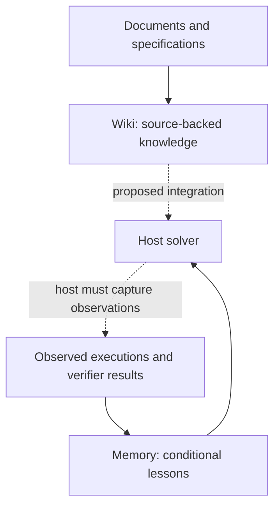

# Concept: conditional experience memory

## The research question

Can an agent retain the actionable part of an experience without losing the conditions
that made it valid—and then use it to improve a different task?

There are three distinct claims to test:

1. **Grounding:** the source observations support the proposed advice.
2. **Applicability:** the new task satisfies its conditions and avoids its exceptions.
3. **Utility:** providing that advice changes actual task outcomes for the better.

A lesson can pass the first two and offer no benefit because the solver already knows
what to do. It can also be relevant yet distract the solver. Selection accuracy and
successful storage do not establish useful learning.

## What Wake–Sleep means here

The host performs tasks. Before a new task, **Wake** selects conditional lessons and
returns bounded advice to the host. After an episode is supplied, **Sleep** asks a writer
to propose lessons and a decision model to assess admission. The optional trigger decides
whether reflection is worthwhile at all.

These are software workflow phases, not biological claims. They can be invoked separately.
The current Hermes adapter supplies a Wake hook; Sleep is an explicit CLI/API operation.
There is no autonomous overnight loop, universal trace collector or background dream worker.
Calling the model changes external memory only; it does not fine-tune Clef or Jev.

## How Dreaming differs

“Dreaming” is not one universal agent API. Here the comparison is specifically with
[DreamCoder's dreaming module](https://github.com/ellisk42/ec/blob/master/dreamcoder/dreaming.py)
and [its main learning loop](https://github.com/ellisk42/ec/blob/master/dreamcoder/dreamcoder.py).
That system searches for programs, learns library structure, and uses generated examples
in recognition-model training. Dreaming is part of a richer learning process; simply
renaming a summarizer “Sleep” does not reproduce it.

Jev Memory currently has neither synthesized practice tasks nor learned executable
abstractions. A possible extension would generate contrasting tasks for a lesson, execute
them against an independent verifier, and use the results to refine its scope. Even that
would be an extension of this memory experiment, not automatically a DreamCoder reproduction.
It is not implemented and has no measured results in this repository.

## LLM Wiki, Jev Wiki and Jev Memory

The [LLM Wiki pattern](https://gist.github.com/karpathy/442a6bf555914893e9891c11519de94f)
maintains persistent, connected knowledge pages from source material. It describes a
pattern rather than a package we import. Our separate [Jev Wiki](https://github.com/JayYun98/jev-wiki)
project applies a writer/judge/code separation to source-backed wiki maintenance.
That repository is public. The projects are independent; neither is a dependency of the other.

Both projects aim to accumulate useful external artifacts while keeping their provenance.
They have different immediate jobs:

- A wiki can preserve an API's documented pagination contract and version changes.
- Episode memory can preserve what happened when an agent used that API and propose a
  conditional lesson about future use.
- The solver must still obey the current task, inspect relevant tools and verify its result.

This is not a strict “facts versus procedures” taxonomy: wiki pages can contain procedures,
and lessons can mention facts. The distinction is which source enters the workflow, what
artifact it maintains and how its usefulness is assessed.

**Current integration status: none.** Jev Memory has no wiki importer/exporter, shared
index or synchronization. Markdown README files do not constitute an LLM Wiki feature.
The shared philosophy is implemented independently; no Wiki source is copied.

A possible future composition is:

Dashed links are proposed or host-owned, not automatic integrations. A wiki assertion
must not silently become proof of a successful execution. Any adapter should preserve
source identity, revision, trust level and namespace. Conflicting or stale knowledge
must remain inspectable rather than being resolved by an unsupported rewrite.

## Why separate writer, judge and code?

Writing a useful abstraction is open-ended. Deciding whether a particular candidate is
supported is a bounded question. Hashing observations, enforcing scope, committing versions
and rejecting stale writes are deterministic operations. The interfaces keep these jobs
inspectable and allow the judge to be replaced without changing the storage contract.

This separation is an experimental design choice, not proof that a specialized judge is
better or cheaper than a single LLM. Local Clef and a local generative judge are supported;
cloud Jev is optional. Scores and thresholds require calibration on development data.

Search remains part of the system: SQLite FTS5 creates the shortlist before applicability
judgment. This can be described as retrieval over learned artifacts. It is not a claim
that RAG cannot maintain memory, use structured knowledge or apply its own decision gates.

## What would establish the concept?

The important comparison holds solver, task, context budget and allowed feedback fixed.
Create memory from support episodes, freeze it, and evaluate separate query tasks with
and without that memory. Measure both gains and harms using independent execution checks.
Include counterexamples where superficially similar advice should not apply. Separate
candidate-quality evaluation from retrieval evaluation and final task success.

Our local checks establish working components, not a validated learning advantage.
The latest generated lesson omitted the intended scope distinction; both judges then
selected the broad advice for two different requests. The earlier rollout comparison
also did not show an advantage for the gated variants. These findings are reasons to
improve and test the hypothesis, not to present the architecture as already successful.

[Results](EVALUATION.md) · [Fresh lifecycle check](REVERIFICATION.md) ·
[Implementation decisions](IMPLEMENTATION.md)

## Harvey and Managed Agents dreaming

The [Harvey post shared by Niko Grupen](https://x.com/nikogrupen/status/2108226990792900876)
is a project inspiration reference. Its X article/media endpoint could not be retrieved
for this comparison; we do not claim a complete reproduction of that article.

The independently accessible [Anthropic announcement](https://claude.com/resources/articles/new-in-claude-managed-agents)
describes scheduled review across sessions and memory stores, pattern extraction and
memory curation. It reports roughly sixfold higher completion rates in Harvey's tests.
This is an external result for their system and test setting, not evidence that this
repository improves legal tasks or reproduces their implementation.

| Capability | Jev Lucid Memory |
|---|---|
| Reflect on supplied experience and retain lessons | Implemented |
| Check lesson applicability before reuse | Implemented |
| Scheduled cross-session memory consolidation | Not implemented; Sleep is explicitly invoked |
| Automatic collection of host session transcripts | Not implemented; observations are caller-supplied |
| Harvey legal-task harness and rubric evaluation | Not implemented or run |
| Reproduction of Harvey's reported performance | Not established |

Managed Agents dreaming and DreamCoder use the word differently: the former curates
session-derived memory, while the latter includes generated training examples and
program-library learning. Our workflow shares reflection and reuse ideas, but does
not reproduce either complete system. See [our actual evaluation](EVALUATION.md).
