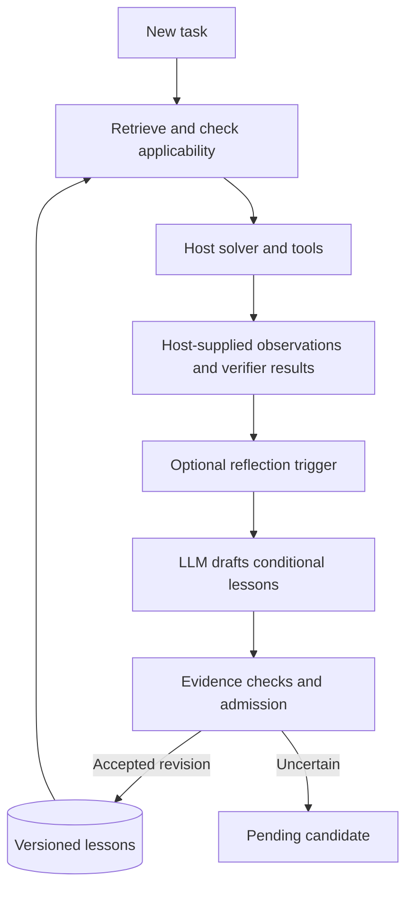

# Architecture and research roadmap

Jev Lucid Memory turns supplied task experience into conditional lessons, then checks
whether to reuse them. This note preserves the design rationale and future work from
the earlier Wakecraft design preview, updated for the current implementation.

The runtime now exists. Local inference and memory mechanics have been exercised.
Improved task performance has **not** been established. See the
[recorded results](EVALUATION.md) and [later re-verification](REVERIFICATION.md).

## How the loop works



The host must supply observations; the diagram does not imply automatic trace capture.
Wake returns bounded advice and may select nothing. Sleep runs when called. Neither
phase trains model weights. The Hermes adapter provides an opt-in Wake hook; Sleep
remains an explicit CLI/API operation.

## Three bounded decisions

These are separate decisions in the current core, rather than one general summary prompt.

| Decision | Question |
|---|---|
| Reflection trigger | Is this episode worth reviewing? |
| Lesson admission | Is the advice supported, transferable and actionable within its stated conditions? |
| Task applicability | Do the lesson's conditions hold for this task, without an exception? |

The LLM drafts text. A **decision model**, such as Jev, assesses the candidate.
Code checks evidence identity, scope and revisions before committing changes.
An independent task verifier is needed to measure utility; admission scores alone
cannot establish it. See the [core implementation](../src/jev_memory/core.py).

## A lesson carries limits

A successful full export does not justify exhausting pagination for every request.
The first-page-only counterexample matters as much as the positive case.

The following excerpt comes from the authored [admission fixture](../examples/admission.jsonl).
It illustrates the intended contract, not an automatically learned success:

```json
{
  "namespace": "demo",
  "trigger": "Fetch all records with cursor pagination",
  "lesson": "Follow next_cursor until it is null when all records are requested.",
  "preconditions": ["The API uses next_cursor; all records are requested."],
  "exceptions": ["Only the first page is requested."],
  "required_tools": ["fetch"],
  "environment": {"api": "v1"}
}
```

This is an excerpt, not a complete admission payload. The fixture also includes an
episode and evidence hashes. See the [actual record schemas](../src/jev_memory/models.py).
Evidence identity and successful transfer are different claims. The latest generated
lesson was too broad; both local judges reused it where the intended narrower lesson
should have been excluded.

## Components and verification status

| Component | Current state |
|---|---|
| Jev through OpenRouter or TypeSafe | Implemented; contract-tested, not evaluated with live cloud calls |
| Local Clef-Flash decision backend | Implemented; real local inference exercised |
| Local generative model | Used for lesson writing and as an alternative judge in local checks |
| SQLite store | Implemented with scoped evidence, immutable revisions and decision traces |
| Hermes | Opt-in Wake hook tested through an isolated host dispatcher; full agent sessions not validated |
| Executable skill library | Future work |

Provider support does not imply equal quality. Keep the writer, decision backend and
host solver conceptually separate. [Local setup](LOCAL.md) and [Hermes setup](HERMES.md)
describe the available paths.

## Evaluation plan

Freeze the support-derived memory before running query tasks. Hold the solver, task
budget and verifier fixed. Compare no memory, lexical retrieval, generative-model
gates and local decision-model gates; hosted Jev can be an additional arm.

Report task success, gains and harms relative to baseline, latency, and compute or
cost per successful task. Also retain task splits, revisions, raw trials and failure
counts. Report gate replay separately from end-to-end task outcomes.

| Track | Status and purpose |
|---|---|
| Synthetic microtasks | Small local checks executed; test correct reuse, harmful reuse and abstention |
| SkillLearnBench | Proposed support → learn → freeze → query evaluation; no results claimed |
| AppWorld | Proposed richer stateful tool evaluation; no results claimed |
| Typed-DSL tasks | Later research on verified program reuse and abstraction; not implemented |

The small executed comparison did not establish an advantage for gated memory over
ordinary retrieval. It is not a general benchmark. [Read the exact results](EVALUATION.md).

## Roadmap

These are research stages, not release commitments.

| Stage | Current position | Next evidence needed |
|---|---|---|
| Observe | Fixtures, decision traces and a small no-memory baseline exist | Broader, independently verified support/query tasks |
| Remember | Conditional lesson storage, admission and Wake retrieval exist | Better condition preservation and measurable transfer without increased harm |
| Reuse procedures | Not implemented | Executable candidates, execution checks and held-out transfer tests |
| Learn abstractions | Not implemented | Typed-DSL experiments, library induction and compositional evaluation |

## Research connections

- **DreamCoder:** inspiration for separating work and learning phases. Its program
  search, learned libraries and recognition-model training are not implemented here.
- **Voyager:** a reference direction for a future executable skill library. Current
  memory stores advice, not verified executable skills.
- **LILO / Stitch:** reference directions for later program and library abstraction.
  They are not dependencies or implemented features.
- **Jev Wiki:** the separate source-backed knowledge project shares the
  writer–decision model–code philosophy. There is no Wiki integration yet.

See [concepts, philosophy and the Wiki/Dreaming comparison](CONCEPT.md),
[implementation decisions](IMPLEMENTATION.md), and [contribution guidance](../CONTRIBUTING.md).
